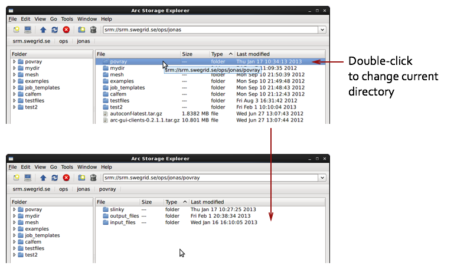

====================
ARC Storage Explorer
====================

The ARC Storage Explorer is a graphical client for access grid storage resources. The client builds on the ARC middlware to support most grid storage protocols. The basic design of the application is a multi-window file browser. Copying between resources are accomplished by drag and drop between file browser windows. To limit and optimise the bandwidth for transferring files, the application implements a file transfer list which can be configured with a maximum number of simultaneous transfers. Most operations in the application are also implemented using threads, to prevent locking up the user interface. However, since many file operations can take a long time to complete some user interface operations disable interaction while operations are ongoing. As the ARC Storage application is a multi-window application, work on different storage resource can be continued by opening an additional storage window.

Starting ARC Storage Explorer
-----------------------------

ARC Storage explorer is started by selecting "Application/Internet/ARC Storage Explorer" in the applications menu in most Linux distributions. The following image shows the start menu in Scientific Linux 6.

.. image:: images/arcstorage-starting-1.png

When ARC Storage Explorer starts it will check for a valid proxy certificate. If not found it will show a dialog with options for creating a proxy certificate. 

Proxy generation
----------------

In the proxy dialog, settings for creating different kind of proxy certificates can be selected. In the first tab "Standard" options for the proxy lifetime and proxy type can be set. 

.. image:: images/arcstorage-proxy-1.png

By selecting the "Not valid after" shows a calender in which a life time of the proxy can be set. In the "Type" dropdown, the type of proxy can be selected. The default is the option of generating a RFC 3820 proxy. The other option is the generation of a standard GSI proxy. 

A non-VOMS proxy can be generated at this point by clicking on the "Generate" button in the lower part of the proxy dialog. This brings up a input box asking for the private key passphrase. Enter the passphrase and click OK to generate the proxy certificate. 

.. image:: images/arcstorage-proxy-6.png

When the proxy has been generated succesfully, a message box is shown confirming this. If proxy generation fails the application exits. A valid proxy certificate is needed for the application to work.

.. image:: images/arcstorage-proxy-7.png

User interface
--------------

The user interface of ARC Storage Explorer is designed as a standard file browser. The main window is shown in the following illustration:

.. image:: images/arcstorage-mainwindow-2.png

The top part of the window contains the menubar, toolbar and URL bar. In the URL-bar a URL can be entered of the the resource to be opened. beneath the toolbar and URL-bar is the path access bar. This toolbar presents the current URL as a set of buttons representing parts of the URL. By clicking on these buttons changes the current working directory to this part of the URL. This enables quick switching of paths without going forward and backwords in the path. 

Below the access bar, the directory- and file views can be found. The directory view shows a directory representation of the current working directory. This view enables quick navigation in the directory tree. Clicking on a directory in the view will also update the file view. 

The file view represents a listing of the current working directory. This is also the main view for file operations such as copying, deleting and viewing files and directories.  

In the lower part of the main window contains a log view. In this view log messages from the lower level middleware (ARC) will be presented. The verbosity of the logging can be changed in the configuration options.

Opening a URL
-------------

To open a URL in the current window, click on the URL-bar and type the desired URL, then click [Enter] to open the selected URL, as shown in the following figure:

.. image:: images/arcstorage-opening-url-2.png

Open a new browser window
-------------------------

ARC Storage Explorer is a multi-window application. To copy files between different URL:s requires 2 windows to drag between. There are two ways of opening a new browser window:

1. Creating a new window with the same URL as the current window.
2. Opening a URL in a new window.

Select **File/New window** in the main menu or use the **Ctrl+N** keyboard shortcut, to create a new window with the same URL as the current window. 

.. image:: images/arcstorage-new-window-1.png

The newly opened window behaves as a separate independent instance of the main window, except that it does not contain a log view. Also, closing the main window will close all opened child windows. ARC Storage Explorer will store the positions of child windows when closing the main window. When the application is opened again the child windows will also be re-opened.

The second option of opening a new window is to use the **File/Open new location** menu item or using the **Ctrl-O** keyboard shortcut. This brings up a window asking for a URL for the new window. 

.. image:: images/arcstorage-new-window-2.png

Browsing files
--------------

There are many ways of browsing the file tree in ARC Storage Explorer. The most used way is to use the file list view together with the **Up** button in the menu and toolbar. Double-clicking on a directory in the file view will change current working directory to the selected directory. 

Using the **Up** button will change the current directory to the parent directory.

Another way of navigating the directory hierarchy is to use the folder view in the left side of the window. Here the directory tree can be explored by either clicking on the folders or using the folder expansion arrows to open any underlying folders. The following images shows how to expand folders in the folder view.

.. figure:: images/arcstorage-browsing-3.png
   
   Selecting the folder expansion icon.
|
.. figure:: images/arcstorage-browsing-4.png
   
   Expanded folder.

Displaying file/directory properties
------------------------------------

Detailed information on the file can be queried by selecting the file or directory and clicking on the right mouse button and selecting **Properties** in the context menu. This action brings up a property window, displaying the properties (metadata) of the selected file or directory.

.. figure:: images/arcstorage-metadata-2.png

   Context menu for selected file.
   
.. figure:: images/arcstorage-metadata-1.png

   Metadata property window.

Copying URL links
-----------------

Copying files
-------------

Creating directories
--------------------

Deleting files
--------------

