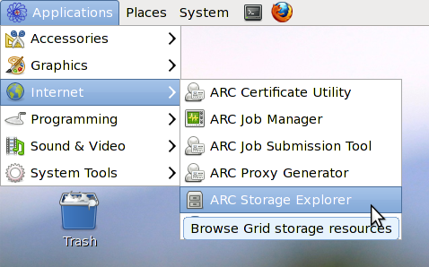
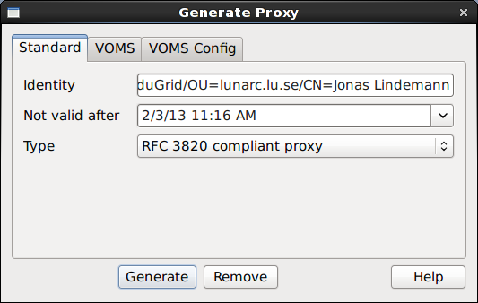
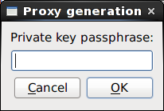
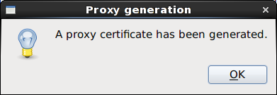

====================
ARC Storage Explorer
====================

The ARC Storage Explorer is a graphical client for access grid storage resources. The client builds on the ARC middlware to support most grid storage protocols. The basic design of the application is a multi-window file browser. Copying between resources are accomplished by drag and drop between file browser windows. To limit and optimise the bandwidth for transferring files, the application implements a file transfer list which can be configured with a maximum number of simultaneous transfers. Most operations in the application are also implemented using threads, to prevent locking up the user interface. However, since many file operations can take a long time to complete some user interface operations disable interaction while operations are ongoing. As the ARC Storage application is a multi-window application, work on different storage resource can be continued by opening an additional storage window.

Starting ARC Storage Explorer
-----------------------------

ARC Storage explorer is started by selecting "Application/Internet/ARC Storage Explorer" in the applications menu in most Linux distributions. The following image shows the start menu in Scientific Linux 6.

When ARC Storage Explorer starts it will check for a valid proxy certificate. If not found it will show a dialog with options for creating a proxy certificate. 

Proxy generation
----------------

In the proxy dialog, settings for creating different kind of proxy certificates can be selected. In the first tab "Standard" options for the proxy lifetime and proxy type can be set. 

By selecting the "Not valid after" shows a calender in which a life time of the proxy can be set. In the "Type" dropdown, the type of proxy can be selected. The default is the option of generating a RFC 3820 proxy. The other option is the generation of a standard GSI proxy. 

A non-VOMS proxy can be generated at this point by clicking on the "Generate" button in the lower part of the proxy dialog. This brings up a input box asking for the private key passphrase. Enter the passphrase and click OK to generate the proxy certificate. 

When the proxy has been generated succesfully, a message box is shown confirming this. If proxy generation fails the application exits. A valid proxy certificate is needed for the application to work.

User interface
--------------

Opening a URL
-------------

Browsing files
--------------

Displaying file directory properties
------------------------------------

Copying URL links
-----------------

Opening a new browser window
----------------------------

Copying files
-------------

Creating directories
--------------------

Deleting files
--------------

